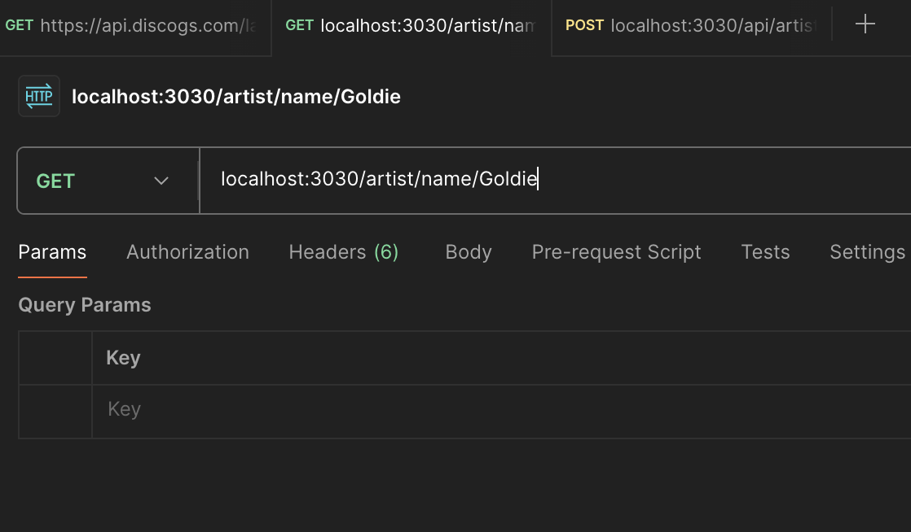

# DB_DNB

drum and bass databse :) simple api for learning


## API Reference

#### Get all Artists, Labels, Releases

```http
  GET /api/artists
```

- root call

#### Get item by given discogs id

\*\*\* note this isnt the \_id given by mongoose

```http
  GET /api/items/id/${id}
```

| Parameter    | Type     | Description                       |
| :----------- | :------- | :-------------------------------- |
| `discogs id` | `number` | **Required**. Id of item to fetch |

#### Get item by given name(artists,labels) or title (releases).

```http
  GET /api/items/name/${name}
  GET /api/items/title/${title}
```

| Parameter    | Type     | Description                                  |
| :----------- | :------- | :------------------------------------------- |
| `discogs id` | `number` | **Required**. name or title of item to fetch |

#### POST new item

```http
  POST /api/items/ body
```

#### Update item by discogs id

```http
  PUT /api/items/${id}
```

| Parameter    | Type     | Description                       |
| :----------- | :------- | :-------------------------------- |
| `discogs id` | `number` | **Required**. id of item to fetch |

#### Update item by discogs id

```http
  DELETE /api/items/${mongo_id}
```

| Parameter   | Type     | Description                        |
| :---------- | :------- | :--------------------------------- |
| `monogo id` | `number` | **Required**. id of item to delete |

## Screenshots

----- an example of a GET


----- an example of a POST


----- an example of a PUT


----- an example of a DELETE


## Appendix

Any additional information goes here
